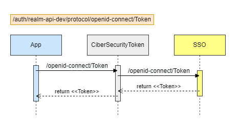

# Descripción General de la Integración

## Índice

- [Descripción General de la Integración](#descripción-general-de-la-integración)
  - [Índice](#índice)
  - [Glosario](#glosario)
  - [1. Características](#1-características)
  - [2. Headers](#2-headers)
    - [Request Header](#request-header)
    - [Response Header](#response-header)
  - [3. Errores](#3-errores)
    - [Manejo de Excepciones](#manejo-de-excepciones)
  - [4. Seguridad](#4-seguridad)

---

## Glosario

| termino | Definición |
| :---- | :--- |
| DF | Diseño Funcional |
| DT | Diseño Técnico |
| OCP | OpenShift Container Platform |
| AKS | Azure Kubernetes Service |
| eTOM | enhanced Telecom Operations Map. Marco de referencia para la definición de los procesos de negocio de los operadores de telecomunicaciones  |
| MPI | Modelo Privado de Información. Modelo de cada aplicacion o sistema |
| MCI | Modelo Común de Información |

---

## 1. Características

| Característica | Descripción |
| -------------- | ----------- |
| **Momento de iniciación** | Por solicitud |
| **Componente desplegado en** | [Fuse - OCP - Rancher - AKS] |
| **Modo** | [Síncrono - Asíncrono] |
| **Complejidad** | [Alto - Medio - Bajo] |
| **Seguridad** | Modelo de Seguridad definido por Colombia |

[Volver al Índice](#índice)

---

## 2. Headers

### Request Header

| Nombre | Valor | Opcional |
| :--- | :--- | :---: |
| authorization | La aplicación debe estar configurada en 3scale para garantizar la autorización para consumir el API. | N |
| system        | Nombre del sistema que realiza la solicitud; ejemplo “FS” | N |
| operation     | identificador de la operación ofrecida por el servicio. Ejemplo: “EscribirSolicitudPC” | N |
| execId        | Identificador único de cada ejecución de la aplicación consumidora. La aplicación consumidora debe generar e informar este valor que deberá ser devuelto en la respuesta: Formato: UUID en forma canónica con 32 dígitos hexadecimales, mostrados en cinco grupos separados por guiones, de la forma 8-4-4-4-12 para un total de 36 caracteres (32 dígitos y 4 guiones medios).<br><br>Patrón: <br>“[a-f0-9]{8}-[a-f0-9]{4}-[a-f0-9]{4}-[a-f0-9]{4}-[a-f0-9]{12}”<br><br> Ejemplo:<br> `550e8400-e29b-41d4-a716-446655440001` | N |
| timestamp     | Marca de tiempo correspondiente al envío del mensaje. Formato: <br>CCYY-MM-DDThh:mm:ss.s[Z\|(+\|-)hh:mm]<br><br> Patron:<br> “\d{4}-\d\d-\d\dT\d\d:\d\d:\d\d.\d\d\d[+\-]\d\d:\d\d”<br><br> Ejemplo:<br> `2014-01-31T09:30:47.233+01:00` | N |
| msgType      | Ejemplo:<br> `REQUEST` | N |
| varArg       | En esta implementación no se usa | Y |

### Response Header

| Nombre | Valor | Opcional |
| :--- | :--- | :---: |
| msgType | Indica el tipo de mensaje y está relacionado con el escenario de uso y modo de interacción.<br> Ejemplo:<br> `RESPONSE` | N |
| varArg | En esta implementación no se usa | Y |

[Volver al Índice](#índice)

---

## 3. Errores

Los siguientes son los errores más comunes de acuerdo con el estándar RFC7231:

| Código | Mensaje | Detalle |
| :---: | :--- | :--- |
| 200 | OK | La operación fue exitosa. |
| 201 | Creado | La operación se realizó correctamente y la solicitud ha creado un nuevo recurso. |
| 202 | Aceptado | La solicitud ha sido aceptada para su procesamiento, pero el procesamiento no se ha completado (todavía). |
| 204 | Sin contenido | La operación fue exitosa y la respuesta intencionalmente no contiene datos. |
| 300 | Opciones múltiples | Este código se utiliza para señalar las versiones de API compatibles, en caso de que se solicite una versión no compatible para un recurso en particular. |
| 303 | Ver otros | La respuesta a la solicitud se puede encontrar en un URI diferente y se puede recuperar utilizando un método GET en ese recurso. |
| 304 | No modificado | La condición especificada en los encabezados condicionales no se cumplió para una operación de lectura. |
| 400 | Petición Incorrecta | En el significado HTTP original, este error indica parámetros no válidos en la solicitud. |
| 401 | No autorizado | Falló la autenticación, pero la aplicación puede volver a intentar la solicitud mediante la autorización. |
| 403 | Prohibido | El servidor entendió la solicitud, pero se niega a cumplirla (por ejemplo, porque la aplicación no tiene permisos para acceder al recurso debido a las limitaciones de la política). |
| 404 | No encontrado | El recurso especificado no existe. |
| 405 | Método no permitido | El método HTTP real (como GET, PUT, POST, DELETE) no es compatible con el recurso. |
| 406 | No aceptable | El tipo de contenido solicitado no es aceptable para el recurso. |
| 408 | Solicitar tiempo de espera | El cliente no produjo una respuesta en el tiempo que el servidor estaba preparado para esperar. |
| 409 | Conflicto | Ocurre en situaciones en las que dos instancias de una aplicación intentan modificar un recurso en paralelo, de forma no sincronizada. |
| 410 | Desaparecido | El recurso solicitado ya no está disponible en el servidor. |
| 411 | Longitud requerida | No se especificó el encabezado Content-Length. |
| 412 | Precondición fallida | La condición especificada en los encabezados de solicitud condicional no se cumplió para una operación. |
| 413 | Carga útil demasiado grande | El tamaño del cuerpo de la solicitud supera el tamaño máximo permitido por la implementación del servidor. |
| 414 | URI demasiado largo | La longitud del URI de la solicitud excede el tamaño máximo permitido por la implementación del servidor. |
| 415 | Tipo no admitido | El tipo de contenido del cuerpo de la solicitud no es compatible con el servidor. |
| 429 | Demasiadas solicitudes | El cliente ha enviado demasiadas solicitudes en un período de tiempo determinado. |
| 500 | Error interno de servidor | Error general del lado del servidor. |
| 503 | Servicio no Disponible | Actualmente, el servidor no puede recibir solicitudes, pero la solicitud se puede reintentar más adelante. |

### Manejo de Excepciones

Para detallar los respectivos errores con excepciones tenga en cuenta los códigos de excepciones de servicio y de políticas de API definidos por la OMA (Open Mobile Alliance). Utilice este tipo de excepciones para definir de una manera más detallada y acertada los errores que podría devolver la API en la que trabaja, agregue a la respuesta de la API los códigos que considere darían valor. Para ver todos los códigos de excepción visite visite este [sitio](https://www.openmobilealliance.org/wp/).

A continuación, se muestran algunos ejemplos del uso de esta especificación:

1. Error de servicio

```yml
Excepción: SVC0001: Service error
MessageId: SVC0001
Text:  A service error occurred. Error code is %1 
HTTP status code: 400 Bad request
```

Ejemplo implementación JSON

```json
{
    "serviceException": {
        "messageId": "SVC0001",
        "text": "A service error occurred. Error code is %1"
    }
}
```

2. Token invalido

```yml
Excepción: SVC2003: Invalid Access token
MessageId: SVC2003
Text:  Invalid Access token 
HTTP status code: 401 Unauthorized, 403 Forbidden
```

Ejemplo implementación JSON

```json
{
    "serviceException": {
        "messageId": "SVC2003",
        "text": "Invalid Access token",
        "variables": "token"
    }
}
```

[Volver al Índice](#índice)

---

## 4. Seguridad

Solo aplica para **OCP** (OpenShift Container Platform)



[Volver al Índice](#índice)
