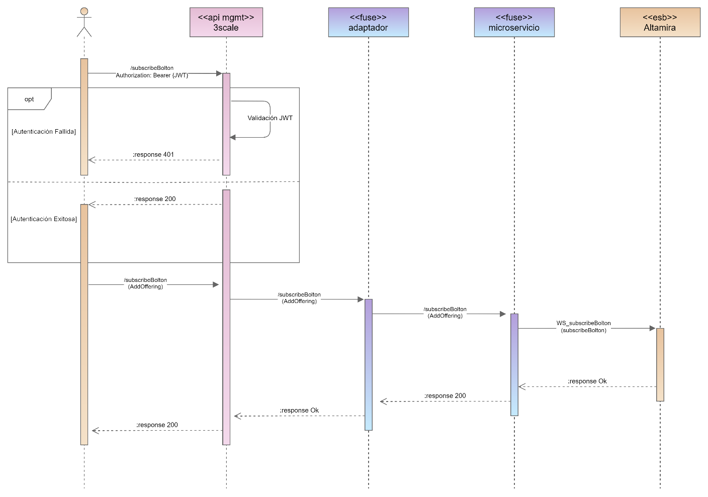

# Diseño Funcional Operación: [Nombre]

## Índice

- [Diseño Funcional Operación: [Nombre]](#diseño-funcional-operación-nombre)
  - [Índice](#índice)
  - [1. Descripción](#1-descripción)
  - [2. Diagrama de Secuencia](#2-diagrama-de-secuencia)
  - [3. Características](#3-características)
  - [4. Estructura del Mensaje](#4-estructura-del-mensaje)
    - [Definición de Campos](#definición-de-campos)
    - [Definición de Grupos](#definición-de-grupos)
  - [5. Ejemplos Mensajes](#5-ejemplos-mensajes)
  - [Diseño Técnico Operación [Nombre]](#diseño-técnico-operación-nombre)
  - [Orquestación de Servicios](#orquestación-de-servicios)
  - [Integración de Servicios](#integración-de-servicios)
    - [1. Características Proveedor](#1-características-proveedor)
    - [2. Mapeo de Campos](#2-mapeo-de-campos)
    - [3. Especificación Mapeo de Valores](#3-especificación-mapeo-de-valores)
    - [4. Mapeo de Errores](#4-mapeo-de-errores)

---

## 1. Descripción

[Descripción de la operación]

[Volver al Índice](#índice)

---

## 2. Diagrama de Secuencia

A continuación, se relaciona el diagrama de secuencia objeto de este diseño.



[Volver al Índice](#índice)

---

## 3. Características

|        Característica        | Descripción                                                                                                                                                                                         |
|:----------------------------:|:----------------------------------------------------------------------------------------------------------------------------------------------------------------------------------------------------|
|        **Iniciador**         | Consumidor interno/externo                                                                                                                                                                          |
| **Método de transferencia**  | REST                                                                                                                                                                                                |
|         **Sintaxis**         | JSON                                                                                                                                                                                                |
|       **Método HTTP**        | GET                                                                                                                                                                                                 |
|       **Path externo**       | ***/[nivel 1 eTOM)]/[telefonica]/[version]/[nombre_microservicio]/[nombre_operación][parametros]***<br> /resource/telefonica/v1/available-ports-info-b2b?Mnemonic=string&Rack=string&Subrack=string |
|       **Path interno**       | ***/[telefonica]/[version]/[nombre_microservicio]/[nombre_operación][parametros]***<br> /telefonica/v1/available-ports-info-b2b?Mnemonic=string&Rack=string&Subrack=string                          |

[Volver al Índice](#índice)

---

## 4. Estructura del Mensaje

### Definición de Campos

| I/O |                 Type                 | Field Name |  Child Fields  | Description |  Type  |  Required?  |
|:---:|:------------------------------------:|:----------:|:--------------:|:-----------:|:------:|:-----------:|
|  I  | [Query Parameters / Path Parameters] |   Texto    | NA |    Texto    | Tipo dato | [Y/N] |
|  O  |                 Body                 |   Texto    | NA |    Texto    | Tipo dato | [Y/N] |
|  O  |                 Body                 |   Texto    | NA |    Texto    | Tipo dato | [Y/N] |


### Definición de Grupos

|  Field Name  |  Description  |  Required?  |
|:------------:|:-------------:|:-----------:|
|    Texto     |     Texto     |    [Y/N]    |
|    Texto     |     Texto     |    [Y/N]    |

[Volver al Índice](#índice)

---

## 5. Ejemplos Mensajes

Request \[URL/body]

```json
{
    
}

```

Response body

```json
{
    
}
```

[Volver al Índice](#índice)

---

## Diseño Técnico Operación [Nombre]

## Orquestación de Servicios

Esta sección no aplica para esta interfaz.

[Volver al Índice](#índice)

---

## Integración de Servicios

### 1. Características Proveedor

| Característica | Descripción |
| -------------- | ----------- |
| **Sistema**    | [backend] |
| **Método de transferencia** |             |
| **Sintaxis** |         |
| **Método HTTP** |      |
| **Servicio** |             |

[Volver al Índice](#índice)

---

### 2. Mapeo de Campos

Input Mappings

|    MPI     |    MPI     | Operation  |   Type    |  Formula   |
|:----------:|:----------:|:----------:|:---------:|:----------:|
|    Text    |    Text    |    Text    |   Text    |    Text    |

Output Mappings

|    MPI     |    MPI     | Operation  |   Type    |  Formula   |
|:----------:|:----------:|:----------:|:---------:|:----------:|
|    Text    |    Text    |    Text    |   Text    |    Text    |

[Volver al Índice](#índice)

---

### 3. Especificación Mapeo de Valores

Esta sección no aplica para esta interfaz.

[Volver al Índice](#índice)

---

### 4. Mapeo de Errores

Cuando ocurre un error en el servicio se debe realizar el mapeo de acuerdo con la sección 2. Mapeo de Campos y el estándar del documento de errores.

[Volver al Índice](#índice)
